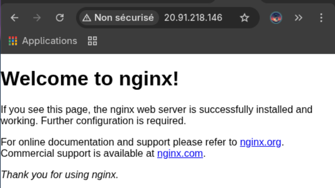
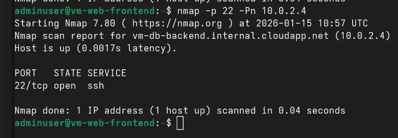
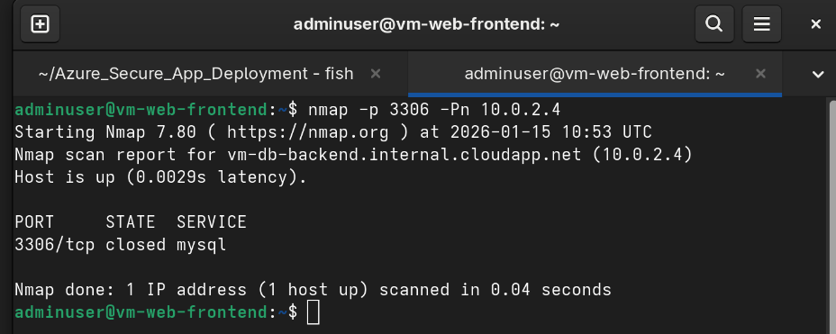
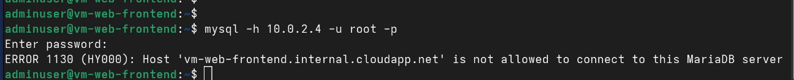
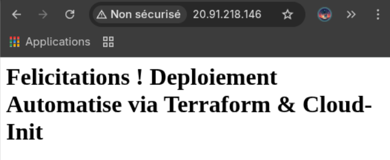

# Azure Secure Architecture: Multi-Tier & Network Isolation


## 📋 Executive Summary
This project demonstrates the implementation of a **"Secure by Design"** cloud infrastructure on Microsoft Azure. The objective is to deploy a 2-Tier application (Web + Data) where the database is strictly isolated from the internet, accessible only via a secured bastion host (Jump Host).

## 🏗️ Technical Architecture (Infrastructure as Code)

The infrastructure is provisioned via **Terraform** in the `Sweden Central` region:

* **Network (VNet):** Strict segmentation.
    * 🟢 **Public Subnet (Frontend):** Hosts the Web Server/Bastion. Accessible via HTTP/SSH.
    * 🔴 **Private Subnet (Backend):** Hosts the Database. **Zero direct Internet access.**
* **Security (NSG):**
    * `AllowMySQLFromWeb` Rule: Authorizes port 3306 *only* from the Frontend subnet (`10.0.1.0/24`).
    * Deny All: All other traffic towards the DB is blocked.

## 🚀 Proof of Concept (POC) & Validation

To validate the architecture, a full connectivity audit was performed using Nginx, Nmap, and MariaDB.

### 1. Public Access Validation (Frontend)
First, we verified that the Public NSG correctly exposes the web server. Nginx was installed on the frontend VM and accessed via the Public IP.


*Evidence: The Nginx Welcome page confirms the Public Subnet is accessible via Port 80.*

### 2. Internal Network Audit (Bastion Perspective)
Using the Frontend VM as a **Bastion**, we scanned the private backend to verify internal routing and NSG rules.

**a) Verifying SSH Access (Internal Management)**

*Result: Port 22 is OPEN internally. This confirms the Frontend can act as a Jump Host.*

**b) Verifying Database Port Filtering**

*Result: Port 3306 is CLOSED (not filtered). This proves the firewall allowed the packet through (Success), but no service was listening yet.*

### 3. Secure Access Method (Tunneling)
To access the private database securely without exposing it to the public internet, we utilized SSH Jump/Tunneling.

.png)
*Concept: Using the Frontend as a secure bridge to reach the isolated Backend.*

### 4. Final Cross-Tier Connectivity
Finally, we installed the MySQL client on the Frontend and attempted to connect to the Backend.

The error `ERROR 1130` below is the definitive proof of success:
1.  ✅ **Network:** The request passed through the NSG (TCP Connection OK).
2.  ✅ **Service:** The DB server received the request (Service Active).
3.  🔒 **Application Security:** The DB rejected the unauthorized root user (Access Restricted).



## 🛠️ Key Commands
* **Deployment:** `terraform apply`
* **Bastion Connection (Jump):** `ssh -J admin@<IP_PUBLIC> admin@<IP_PRIVATE>`
* **Network Audit:** `nmap -p 3306 <IP_PRIVATE>`

## 🤖 Level 3: DevOps Automation (Infrastructure as Code)

To move beyond manual configuration, **Cloud-Init** was implemented to achieve **Immutable Infrastructure**.
Instead of manually installing software via SSH, the Nginx web server is automatically provisioned during the VM boot process.

**Terraform Implementation:**
A bash script is injected via the `custom_data` attribute of the Virtual Machine resource.

```hcl
# In compute.tf
custom_data = filebase64("install_nginx.sh")
```



Result: The web server is fully operational 60 seconds after deployment without any human intervention.